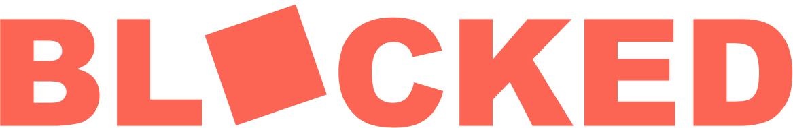

# blocked
A tile based board game with directional blocking.

- [Download Print and Play](BLOCKED.pdf)

- [View the Rules](Squib/RULES.md)

- BLOCKED was built using [Squib](https://github.com/andymeneely/squib). Learn how to use Ruby and modify the game tiles or edge counts.
